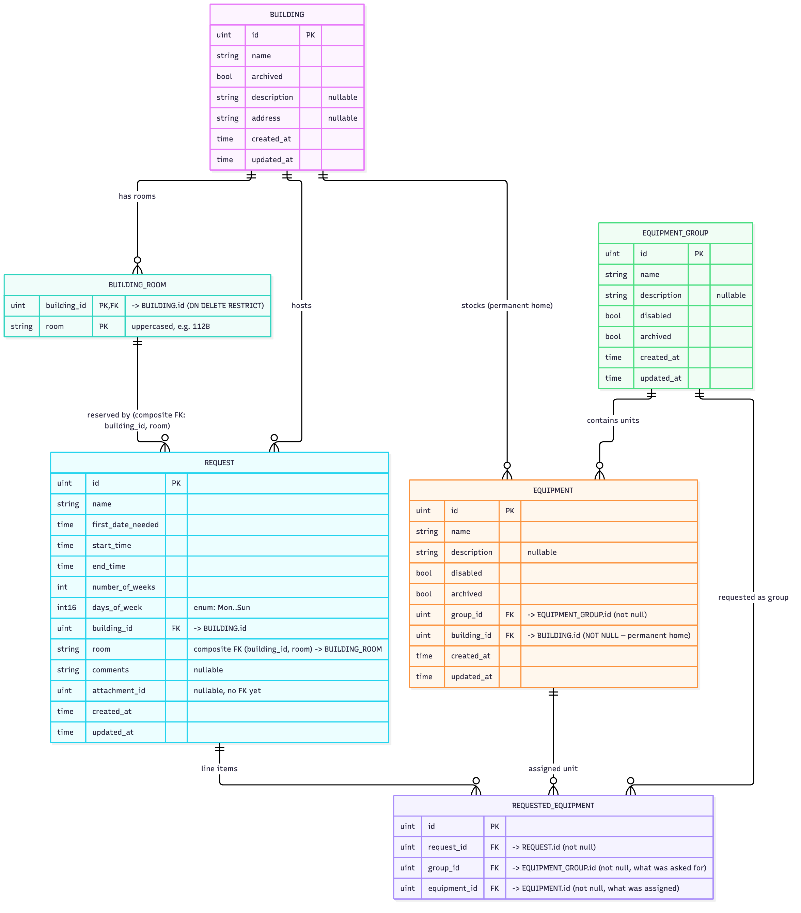

## Building, room, and request integrity

The diagram above is generated from `ERD/OmniAv_ERD.mmd` (`mmdc -i ERD/OmniAv_ERD.mmd -o ERD/OmniAv_ERD.png -s 3 -b white`).

- `building_rooms.building_id` is a foreign key to `buildings.id`, so a room can't exist without a building.
- `requests(building_id, room)` is a composite foreign key to `building_rooms(building_id, room)`, so a request's room must exist in the request's building. It is added by `models.AddRequestRoomConstraint`, because GORM can't model it from struct tags.
- Deletes are `RESTRICT`: a room used by a request can't be removed, and rooms have no delete endpoint.
- Room names are trimmed and uppercased when a request is created, so `112b` and `112B` are the same room. Requests auto-create unknown rooms; the picker reads them from `GET /api/buildings/:id/rooms`.
- Equipment stays in its home building (`equipment.building_id`, not null); a unit can move between rooms of that building across non-overlapping bookings.
